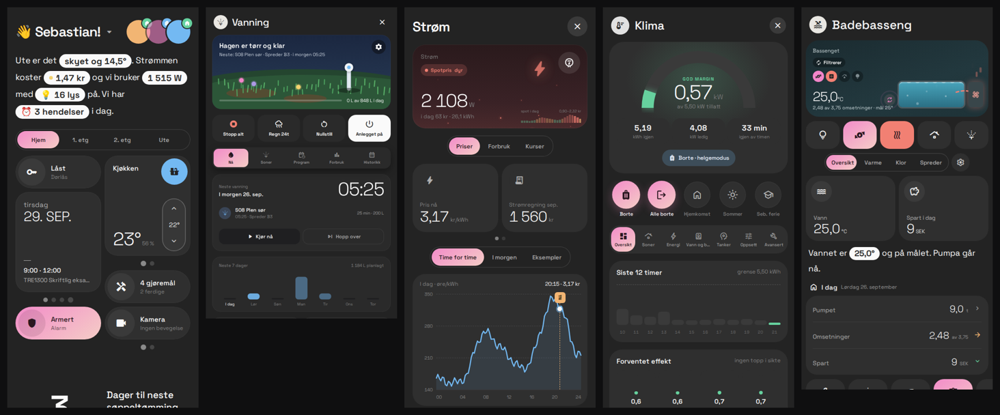

# KI Claude

Home Assistant-dashboardet designet i **Claude Design**, bygget som ett HACS-kort – piksel for
piksel likt prototypen, og koblet til ki-integrasjonene:

| Skjerm | Integrasjon |
|---|---|
| Hjem | HA-områder/etasjer, [ki-rom](https://github.com/SebastianKristo/ki-rom), [ki-sovn](https://github.com/SebastianKristo/ki-sovn), [ki-varslinger](https://github.com/SebastianKristo/ki-varslinger), personer, vær, pris, lås, alarm … |
| Vanning | [ki-vanning](https://github.com/SebastianKristo/ki-vanning) |
| Basseng | [ki-basseng](https://github.com/SebastianKristo/ki-basseng) |
| Strøm, Strømpriser, Strømregning, Norgespris, Strøminnstillinger | [ki-strom](https://github.com/SebastianKristo/ki-strom) (KI Energi) |
| Klima, Varmepumpe | [ki-strom](https://github.com/SebastianKristo/ki-strom) + `climate.*` |
| Lys, Jul, Rom | [ki-lys](https://github.com/SebastianKristo/ki-lys), [ki-rom](https://github.com/SebastianKristo/ki-rom), [ki-utelys](https://github.com/SebastianKristo/ki-utelys) |
| Søvn | [ki-sovn](https://github.com/SebastianKristo/ki-sovn), [ki-vekking](https://github.com/SebastianKristo/ki-vekking) |
| Planter | [ki-planter](https://github.com/SebastianKristo/ki-planter) |
| Sikkerhet, Dører | [ki-varslinger](https://github.com/SebastianKristo/ki-varslinger), [ki-hyttebes-k](https://github.com/SebastianKristo/ki-hyttebes-k), `lock.*`, `alarm_control_panel.*` |
| Innstillinger | [ki-nattmodus](https://github.com/SebastianKristo/ki-nattmodus), [ki-utelys](https://github.com/SebastianKristo/ki-utelys), [ki-varslinger](https://github.com/SebastianKristo/ki-varslinger) |
| Vær, Kalender, Bursdager og post, Gjøremål, Søppel, Media, Støvsuger, Gressklipper, Kamera, Person, Bil, 3D-printer, Drivstoff, Helse, Datamaskiner, Server, Ruter (Entur), iPad | standard HA-entiteter (autodeteksjon + alias), Kalender-hytta via [ki-hyttebes-k](https://github.com/SebastianKristo/ki-hyttebes-k) |

Finnes ikke en integrasjon/entitet, viser skjermen designets egne demodata – så alt ser alltid
ut som i Claude Design, og blir «levende» etter hvert som integrasjonene er på plass.



## Installasjon (HACS)

1. HACS → ⋮ → *Custom repositories* → `https://github.com/SebastianKristo/ki-claude`, kategori **Dashboard**.
2. Last ned **KI Claude**. HACS legger til ressursen `/hacsfiles/ki-claude/ki-claude.js`.
3. Hard-refresh nettleseren (Ctrl/Cmd + Shift + R).

Manuelt: kopier `dist/ki-claude.js` til `/config/www/` og legg til `/local/ki-claude.js`
som *JavaScript-modul* under Innstillinger → Dashbord → Ressurser.

## Bruk

Hele dashboardet (anbefalt i en **panel**-visning, gjerne sammen med kiosk-mode):

```yaml
views:
  - title: Hjem
    path: hjem
    type: panel
    cards:
      - type: custom:ki-claude-card
```

Eller la kortet lage hele dashboardet: nytt dashbord → ⋮ → *Rediger* → *Rå konfigurasjon*:

```yaml
strategy:
  type: custom:ki-claude
```

(Hjem og iPad blir egne panel-visninger. Alle kortvalg under kan også settes her.)

### Popups med Bubble Card

Alle popups i Hjem (Vanning, Strøm, Sikkerhet, Lys, rom, personer …) åpnes som
[Bubble Card](https://github.com/Clooos/Bubble-Card)-pop-ups (≥ 3.2) når Bubble Card er installert.
Med strategien over skjer dette automatisk: den lager én pop-up per skjerm (`#ki-<nøkkel>`),
én per HA-område (`#ki-rom-<area_id>`) og én per person (`#ki-person-<id>`). Toppen i
pop-upen er designets egen popup-topp. Uten Bubble Card brukes designets innebygde ark
(`popups: intern` tvinger det).

Manuelt oppsett – Hjem-kortet får `popups: bubble`, og hver pop-up er et Bubble Card:

```yaml
type: vertical-stack
cards:
  - type: custom:ki-claude-card
    popups: bubble
  - type: custom:bubble-card
    card_type: pop-up
    hash: '#ki-vann'
    show_header: false
    bg_color: '#232323'
    bg_opacity: '100'
    width_desktop: 440px
    cards:
      - type: custom:ki-claude-card
        popup: vann          # skjermen velges ut fra nøkkelen
  - type: custom:bubble-card
    card_type: pop-up
    hash: '#ki-rom-stue'
    show_header: false
    bg_color: '#232323'
    bg_opacity: '100'
    cards:
      - type: custom:ki-claude-card
        popup: rom-stue
        props: { roomId: stue }
```

Nøkler: `strom`, `sik`, `vann`, `vac`, `media`, `car`, `server`, `settings`, `cal`, `vaer`, `lys`,
`cam`, `klima`, `trash`, `todo`, `plants`, `sleep`, `bill`, `pool`, `mower`, `nibe`, `printer`,
`fuel`, `ruter`, `pcs`, `helse`, `norgespris`, `elset`, `jul`, `doors`, `rom-<area_id>`,
`person-<id>`. Pop-up-kortet monteres først når pop-upen åpnes.

`layout: auto | mobil | stor` styrer mobil- og nettbrett-oppsettet (standard `auto`).

iPad-dashboardet:

```yaml
type: custom:ki-claude-ipad-card
```

Én enkelt skjerm, f.eks. i en popup eller et eksisterende dashbord:

```yaml
type: custom:ki-claude-card
screen: Vanning
```

Gyldige skjermer: `hjem`, `vanning`, `basseng`, `strøm`, `strømpriser`, `strømregning`,
`norgespris`, `strøminnstillinger`, `klima`, `varmepumpe`, `lys`, `jul`, `rom`, `søvn`,
`planter`, `sikkerhet`, `dører`, `kamera`, `person`, `vær`, `kalender`, `bursdager og post`,
`gjøremål`, `søppel`, `media`, `støvsuger`, `gressklipper`, `bil`, `3d-printer`, `drivstoff`,
`helse`, `datamaskiner`, `server`, `ruter`, `innstillinger`, `ipad dashboard`.
Skjermer som tar egenskaper fra Hjem kan få dem via `props`, f.eks.
`props: { roomId: stue }` for Rom eller `props: { personId: sebastian }` for Person.

### Overstyre entiteter og bilder

Autodeteksjonen finner det meste selv. Vil du peke på en bestemt entitet, bruk alias-navnet
fra dokumentasjonen til skjermen ([docs/screens](docs/screens)):

```yaml
type: custom:ki-claude-card
entities:
  las: lock.inngangsdor
  pris: sensor.nordpool_kwh_no1_nok
  effekt: sensor.tibber_pulse_power
  vaer: weather.forecast_hjem
calendars: [calendar.familie, calendar.skole]
images:
  bil-v3-foto: /local/bil.jpg
```

## Oppsett og tilpasning

Alt som kan tilpasses i designet (faner, rom, størrelser, snarveier, tekst-setningene,
varsler på rom og navbar, navbar-stil, popup-seksjoner, header) gjøres direkte i dashboardet
via «Tilpass Hjem» / «Tilpass navbar» i ⋯-menyen, og lagres per nettleser – som i prototypen.

## Utvikling

Designfilene fra Claude Design ligger uendret i `src/screens/*.dc.html` (template + logikk).
Koblingen til Home Assistant skjer i hver fils script via `ha`-broen – se
[docs/WIRING.md](docs/WIRING.md).

```bash
npm ci
npm run build     # → dist/ki-claude.js
npm run watch
```

Runtime-en (`src/runtime/dc.js`) er en port av Claude Designs dc-runtime som rendrer designene
i kortets shadow DOM med React 18.

## Lisens

Apache 2.0. Inkluderer React (MIT).
